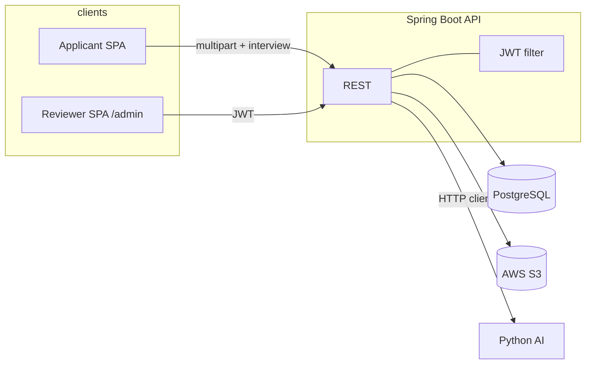
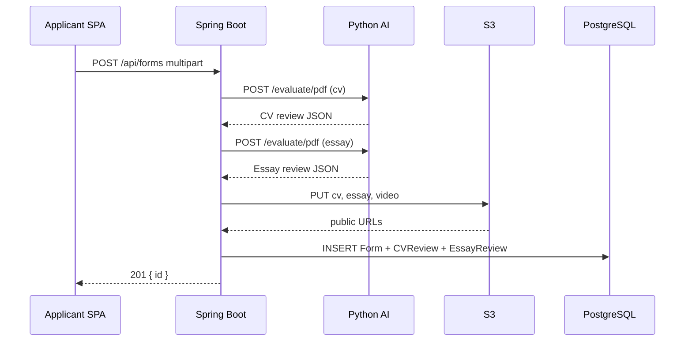

Here is a **single pack** you can paste into Claude (or any diagram tool): **context, architecture, flows, data model, integrations, and security**. I’ve **left out real secrets** from your repo (DB password, JWT secret, AWS keys)—tell Claude those come from **env / config** in production.

---

## 1. Project one-liner (hackathon)

**InVision U** — End-to-end **admissions-style platform**: applicants use a **React SPA** to pick a program, submit a **multipart application** (CV PDF, essay PDF, intro video), then complete a **stateful AI chat interview**; **reviewers** use a **JWT-protected dashboard** (same SPA, admin routes) to list candidates, open **CV / essay** (TeX-wrapped extracted text + S3 PDF URLs + AI highlights and scores), read **interview analysis**, and **PATCH** application status. A **Spring Boot** backend orchestrates validation, calls a **Python AI service** for document scoring and interview, persists to **PostgreSQL**, stores binaries in **S3**.

---

## 2. Tech stack

### Frontend (this repo: `inVision-front`)

| Layer | Choice |
|--------|--------|
| Runtime | **TypeScript** on **React 19** |
| Build | **Vite 8** |
| Routing | **React Router 7** |
| HTTP | **Axios** (JSON + `Authorization: Bearer`) + **`fetch`** (multipart form, interview JSON) |
| State | **Zustand** (persisted application draft, `applicationId`, selected program) |
| Styling | **Tailwind CSS 4** |
| Dev proxy | Vite: `/api` → `http://localhost:8080` |

**Env (no values):** `VITE_API_BASE_URL`, `VITE_USE_MOCK_DATA`, `VITE_USE_MOCK_APPLICATION`, `VITE_USE_MOCK_ADMIN`.

### Backend (expected / hackathon server)

| Layer | Choice |
|--------|--------|
| Runtime | **Java 21** |
| Framework | **Spring Boot** (~4.x), Spring Web, Spring Data JPA, Spring Security |
| DB | **PostgreSQL**, Hibernate `ddl-auto: update` (typical hackathon) |
| Object storage | **AWS S3** (SDK v2), **public HTTPS URLs** returned to clients (`cvPdfUrl`, `essayPdfUrl`, legacy `cvUrl` / essay URL fields) |
| Auth | **JWT** (stateless), filter on `Authorization: Bearer …` |
| HTTP client to AI | **RestTemplate** (or WebClient) — multipart to FastAPI-style **`/evaluate/pdf`**, JSON to **`/interview/start`** and **`/interview/{id}/reply`** |
| API docs | **springdoc-openapi** (`/swagger-ui`, `/v3/api-docs`) |
| PDF text (dashboard) | **Apache PDFBox** — extract text, wrap in LaTeX `\begin{verbatim}...\end{verbatim}` for `cvFullText` / `essayFullText` |

**External AI service** (separate process): base URL from config, e.g. `ai.evaluator.base-url` → default `http://127.0.0.1:8000`.

---

## 3. Logical architecture (for a box diagram)

```
[Applicant — React SPA public routes]
        |
        v
+------------------+
|  Spring Boot API |
+------------------+
   |      |      |
   |      |      +-------------------> [AWS S3]  (cv/, essay/, videos/ — public URLs)
   |      |
   |      +--------------------------> [PostgreSQL]  (forms, reviews, users, interviews)
   |
   +----------------------------------> [Python AI Service]
         POST /evaluate/pdf  (multipart: file, mode, user_id)
         POST /interview/start
         POST /interview/{sessionId}/reply

[Reviewer — React SPA /admin/*]
        |
        v  JWT (localStorage admin_token, Axios interceptor)
   same Spring Boot API  (/api/dashboard/**)
```

---

## 4. Security model (for an auth flow diagram)

- **Stateless JWT**; no server sessions for staff.
- **`permitAll`** (typical; confirm in your `SecurityFilterChain`): applicant-facing **`/api/forms`**, **`/api/interview/**`**, **`/api/auth/login`**, Swagger/OpenAPI. Frontend also calls **`POST /applications/chatbot`** (path may vary—align with Spring).
- **`authenticated`** (JWT): **`/api/dashboard/**`** and other protected resources.
- **401** clears token on SPA and redirects to `/admin/login`.

**Login:** `POST /api/auth/login` with `{ username, password }` → `{ token }`. Dashboard requests: `Authorization: Bearer <token>`.

**Note:** Applicant SPA does **not** send JWT for form or interview; only admin routes use the token.

---

## 5. Main HTTP surface (for an API map)

| Area | Method + path | Purpose |
|------|----------------|---------|
| Auth | `POST /api/auth/login` | Staff login → JWT |
| Applicant | `POST /api/forms` | Multipart submit → **201** + body with **`id`** (application id as string/number) |
| Applicant (legacy sync) | `POST /api/applications/chatbot` | Optional: `{ applicationId, answers[] }` — SPA calls on interview **finish**; failures ignored so user still reaches success page |
| Interview | `POST /api/interview/start` | Proxy → AI; returns `session_id`, first question, progress, optional scoring |
| Interview | `POST /api/interview/{sessionId}/reply` | Proxy → AI; next question or completed |
| Dashboard | `GET /api/dashboard/candidates` | List rows for leaderboard |
| Dashboard | `GET /api/dashboard/candidates/{id}/cv-review` | `cvFullText` (TeX verbatim), **`cvPdfUrl`** (preferred) + optional legacy **`cvUrl`**, **`cvReview`** |
| Dashboard | `GET /api/dashboard/candidates/{id}/essay-review` | Same for essay + **`essayPdfUrl`** / **`essayUrl`**, **`essayReview`** |
| Dashboard | `GET /api/dashboard/candidates/{id}/chatbot-analysis` | Stored interview + scores; **404** if none (SPA handles) |
| Dashboard | `PATCH /api/dashboard/candidates/{id}/status` | Body: `pending` \| `accepted` \| `rejected` (frontend casing; backend may use enums) |

**Frontend multipart field names** (Spring binding): `fullName`, `email`, `phone`, `dateOfBirth`, `city`, `schoolUniversity`, `gpa`, `fieldOfStudy`; files: **`cv`**, **`motivationEssay`**, **`introductionVideo`**.

---

## 6. Sequence: applicant form submit (for a sequence diagram)

1. Client **`POST /api/forms`** (`multipart/form-data`): personal fields + **CV PDF** + **essay PDF** + **MP4** video.
2. **Validation:** size/type (frontend enforces rules; backend should re-validate).
3. **AI — CV:** `POST {aiBase}/evaluate/pdf` with `file`, `mode=cv`, `user_id` (e.g. applicant name or email).
4. **AI — essay:** same with `mode=essay`.
5. **S3:** upload artifacts; store **public HTTPS URLs** on **`Form`** (expose as `cvPdfUrl` / `essayPdfUrl` to dashboard).
6. **DB (transactional):** save **`Form`**, **`CVReview`**, **`EssayReview`** (1:1) from AI JSON.
7. Response **201** with **`id`** → React stores as **`applicationId`** (Zustand) for interview step.

---

## 7. Sequence: interview (for a second sequence diagram)

1. Client **`POST /api/interview/start`** with body the SPA sends as **`candidate_id`** + **`candidate_stage`** (aliases normalized server-side to e.g. `school` | `university` | `unknown`).
2. Backend → **`POST {aiBase}/interview/start`**.
3. Client loops: **`POST /api/interview/{sessionId}/reply`** with **`{ answer }`**.
4. Backend → AI **`/interview/{sessionId}/reply`**.
5. When **interview completed**, persist **`InterviewResult`** (`session_id`, `candidate_id`, scores, summary, full **`response_json`**, flags, timestamps).
6. Optionally: SPA **`POST /applications/chatbot`** to attach simplified answer list to `applicationId` (legacy path; may be no-op if interview persistence is enough).

---

## 8. Sequence: reviewer dashboard — CV panel (third sequence)

1. Client with **JWT**: **`GET /api/dashboard/candidates/{id}/cv-review`**.
2. Load **`Form`** + **`CVReview`** from DB.
3. **`ApplicantPdfTexService`** (or equivalent): fetch PDF from **S3** (by stored URL/key), **PDFBox** → plain text → wrap **`verbatim`** → **`cvFullText`**.
4. Return **`cvPdfUrl`** (and/or legacy **`cvUrl`**) for **open in new tab**.
5. Return **`cvReview`**: overall + per-criterion scores, summary, **`highlights[]`** with **`text`**, **`reason`**, **`sentiment`** (frontend matches `text` inside unwrapped body for inline highlights).

Essay panel: identical pattern with essay entity + URLs.

---

## 9. Data model (ERD-style bullets)

- **`User`** — staff; used by auth.
- **`Form`** / `application_forms` — applicant fields, **S3 URLs** for CV, essay, video, **`status`** (PENDING / ACCEPTED / REJECTED or equivalent), program id, timestamps.
- **`CVReview`** — **1:1** `form_id`; scores, summary, evidence/highlight structures aligned with frontend `CVReview` type.
- **`EssayReview`** — **1:1** `form_id`; similar; optional **AI-generated** flag / confidence.
- **`InterviewResult`** — **`session_id`** (unique); **`candidate_id`** string; scores; **`jury_session_summary`**; **`response_json`**; completion flags.

**Dashboard list:** backend may filter to forms with **both** reviews (per your policy).

**Interview ↔ form linking:** resolve by **`candidate_id`** matching **form id as string** and/or **applicant email** (soft link if no FK—call out in diagrams as integration constraint).

---

## 10. Key backend services (for a component diagram)

| Service | Role |
|---------|------|
| `FormService` | Validation → AI ×2 → S3 ×3 → persist form + reviews |
| `AISummarizeService` | Multipart to `/evaluate/pdf`; map to review entities |
| `S3Service` | Upload; public URLs; download for PDF text extraction |
| `FormPersistenceService` | Transactional save |
| `AuthService` / `JwtService` / JWT filter | Login + validation |
| `InterviewService` | Proxy interview API + stage normalization |
| `InterviewResultPersistenceService` | Save on interview complete |
| `DashboardService` | List, cv-review, essay-review, chatbot-analysis, status PATCH |
| `ApplicantPdfTexService` | S3 PDF → text → LaTeX verbatim |

---

## 11. Key frontend modules (for a second component slice)

| Area | Role |
|------|------|
| `api/client.ts` | Axios + Bearer; 401 → logout redirect |
| `api/services/application.ts` | `POST /api/forms` (multipart), optional chatbot POST, mock flags |
| `api/services/interviewApi.ts` | `fetch` interview start/reply; normalize snake_case |
| `api/services/dashboard.ts` | GET/PATCH dashboard endpoints |
| `utils/dashboardCandidate.ts` | DTO → merged **`Candidate`** for UI |
| `utils/latexDocumentText.ts` | Strip `\begin{verbatim}...\end{verbatim}` for display |
| `utils/candidateDocuments.ts` | **`cvPdfUrl` ?? `cvUrl`** for links |
| `pages/public/*` | Landing → program → apply → interview → success |
| `pages/admin/*` | Login, leaderboard, candidate detail tabs |

---

## 12. Config knobs (no secret values)

- **`spring.datasource.*`** — PostgreSQL.
- **`jwt.secret`**, **`jwt.expiration`**.
- **`aws.*`** — S3 credentials, bucket, region.
- **`ai.evaluator.base-url`** — Python service host for PDF + interview.
- **Multipart limits** in Spring.
- **Frontend:** `VITE_API_BASE_URL` for production API origin.

---

## 13. Mermaid — system context



---

## 14. Mermaid — form submit



---

## 15. Suggested visuals for the hackathon deck

1. **System context** — two SPA personas, Spring API, Postgres, S3, Python AI.  
2. **Submit pipeline** — validation → dual PDF AI → S3 → DB → return id.  
3. **Interview pipeline** — start → reply loop → persist `InterviewResult` on complete.  
4. **Reviewer flow** — login → JWT → list → detail (CV / essay / chatbot tabs) → PATCH status.  
5. **ERD** — User, Form, CVReview, EssayReview, InterviewResult.  
6. **Security** — public routes vs JWT-protected dashboard.  
7. **Frontend route map** — `/` … `/apply` … `/interview` vs `/admin` … `/admin/candidates/:id`.

---

You can paste **sections 1–12 + Mermaid** into Claude and ask: *“Turn this into a clean architecture diagram + 3 sequence diagrams + ERD for a hackathon slide deck.”*

This file lives at **`docs/CLAUDE_ARCHITECTURE_PACK.md`** in the frontend repo.
