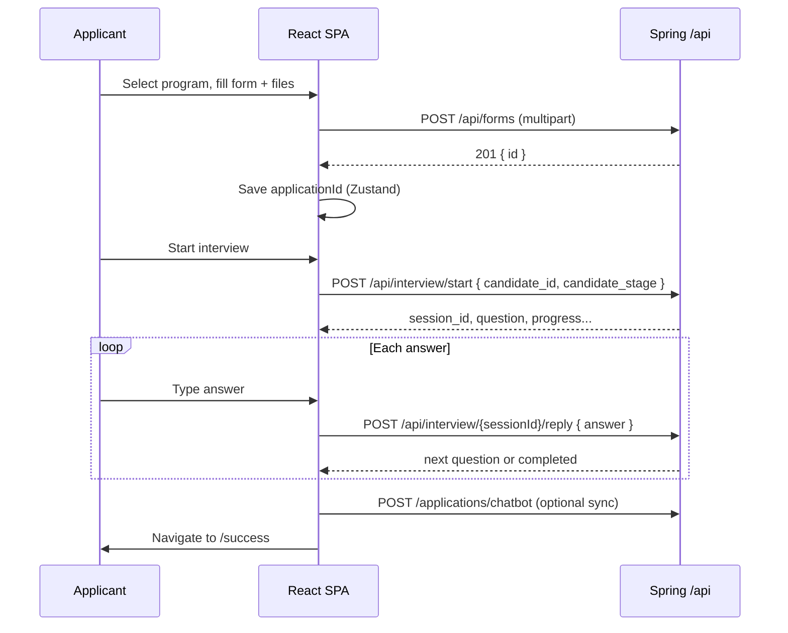
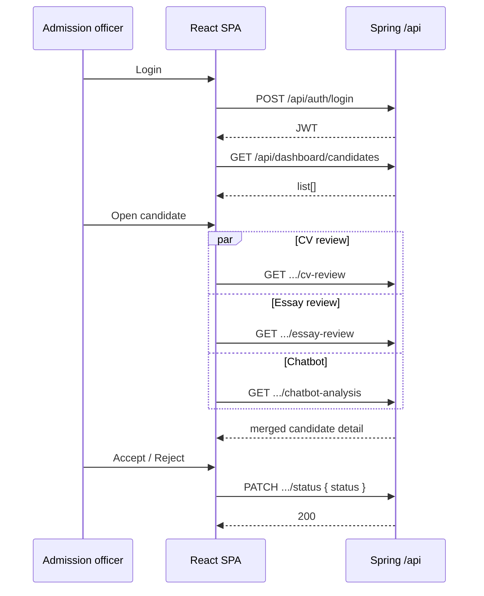

# inVision U — Hackathon architecture & flow brief

Use this document to generate **flowcharts**, **C4/context diagrams**, and **sequence diagrams** (e.g. in Mermaid). It reflects the **inVision-front** React app and the **Spring Boot / API** contracts it expects.

---

## 1. What this project is

- **Product**: Grant-funded admissions platform for **inVision U** (Central Asia future-leaders program, inspired by inDrive’s mission).
- **Applicants**: Browse programs → apply (multipart form: CV PDF, motivation essay PDF, intro video + personal data) → **AI-assisted chat interview** → success screen.
- **Admissions (admin)**: JWT login → **leaderboard** of candidates → **per-candidate review**: CV analysis, essay analysis, chatbot/interview transcript, holistic AI scores → **accept / reject** (PATCH status).
- **Hackathon angle**: Holistic screening with **structured criteria** (leadership, proactiveness, energy), **document understanding** (highlights on extracted text), and **human-in-the-loop** decisions.

---

## 2. Tech stack (frontend repo)

| Layer | Choice |
|--------|--------|
| UI | React 19, TypeScript |
| Build | Vite 8 |
| Routing | React Router 7 |
| HTTP | Axios (`apiClient`) + raw `fetch` for multipart and interview |
| Client state | Zustand (`useApplicationStore` persisted; `useCandidateStore`; `useAuthStore`) |
| Styling | Tailwind CSS 4, Manrope + JetBrains Mono |
| Charts | Recharts (admin leaderboard radar) |

**Dev proxy**: Vite proxies `/api` → `http://localhost:8080` (Spring Boot).

**Env (typical)**:

- `VITE_API_BASE_URL` — Spring root, e.g. `http://localhost:8080` (no trailing slash). Empty = same-origin `/api` via proxy.
- `VITE_USE_MOCK_DATA` — admin dashboard uses `MOCK_CANDIDATES` instead of API.
- `VITE_USE_MOCK_APPLICATION` — skip real form + chatbot POST; mock IDs.
- `VITE_USE_MOCK_ADMIN` — demo login without `/api/auth/login`.

---

## 3. Route map (frontend)

| Path | Shell | Purpose |
|------|--------|---------|
| `/` | Public | Landing |
| `/select-program` | Public | Pick 1 of 5 programs (Zustand) |
| `/apply` | Public | Application form → `POST /api/forms` |
| `/interview` | Public | Chat interview (requires `applicationId` in store) |
| `/success` | Public | Confirmation |
| `/admin/login` | None | Admin JWT login |
| `/admin` | AppShell + **ProtectedRoute** | Leaderboard |
| `/admin/candidates/:id` | AppShell | Candidate detail (CV / Essay / Chatbot tabs) |

**Auth**: `admin_token` (JWT) in `localStorage`; Axios sends `Authorization: Bearer …`. `401` → redirect to `/admin/login`.

---

## 4. Backend API surface (as consumed by the frontend)

Base: `{API_ROOT}/api` unless noted. **Backend implementers**: align naming with this table.

### 4.1 Applicant / public

| Method | Path | Body | Success | Notes |
|--------|------|------|---------|--------|
| `POST` | `/api/forms` | `multipart/form-data` | `201` + JSON `{ id }` | Application id returned as string/number → `applicationId` |
| `POST` | `/api/applications/chatbot` | JSON `{ applicationId, answers[] }` | `2xx` | **Legacy/sync**; UI calls on interview “finish”; errors ignored so UX still navigates to success |
| `GET` | `/api/chatbot/questions` | — | `ChatbotQuestion[]` | Used when mock application mode; not the main live interview driver |

**Multipart field names** (Spring-style, from `buildSpringApplicationFormData`):

- `fullName`, `email`, `phone`, `dateOfBirth` (often `MM/dd/yyyy` from ISO date input), `city`, `schoolUniversity`, `gpa`, `fieldOfStudy` (label string for student level)
- Files: `cv` (PDF), `motivationEssay` (PDF), `introductionVideo` (video)

### 4.2 Interview service (stateful session — **primary interview flow**)

| Method | Path | Body | Role |
|--------|------|------|------|
| `POST` | `/api/interview/start` | JSON `{ candidate_id, candidate_stage }` | Start session; returns `session_id`, first `question`, progress, optional `scoring`, `interview.conversation`, etc. |
| `POST` | `/api/interview/{sessionId}/reply` | JSON `{ answer }` | Send answer; returns next question or completion flags |

Response is **normalized** in the client (camelCase + snake_case). Important fields: `sessionId`, `questionText`, `interviewCompleted`, `questionsAsked`, `maxQuestions`, `jurySessionSummary`, `scoring`, `conversation`, `feedbackForJury`.

**Session id** stored in `sessionStorage` for recovery.

### 4.3 Admin / dashboard

| Method | Path | Auth | Role |
|--------|------|------|------|
| `POST` | `/api/auth/login` | — | Body `{ username, password }` → `{ token }` JWT |
| `GET` | `/api/dashboard/candidates` | Bearer | List rows for leaderboard |
| `GET` | `/api/dashboard/candidates/:id/cv-review` | Bearer | CV full text, PDF URLs, `cvReview` (scores, summary, highlights) |
| `GET` | `/api/dashboard/candidates/:id/essay-review` | Bearer | Same pattern for essay |
| `GET` | `/api/dashboard/candidates/:id/chatbot-analysis` | Bearer | Turns + scores + summary; **404** = no interview linked (handled) |
| `PATCH` | `/api/dashboard/candidates/:id/status` | Bearer | Body `{ status: 'pending' \| 'accepted' \| 'rejected' }` |

### 4.4 Dashboard JSON shapes (frontend types)

**List item** (`DashboardCandidateListItem`): `id`, `fullName`, `email`, `fieldOfStudy`, `programId`, `submissionDate`, `aiScore`, `criteriaScores`, `status`.

**CV review response**:

- `cvFullText`: often LaTeX fragment with `\begin{verbatim}...\end{verbatim}` around PDF extract (plain text inside).
- `cvPdfUrl` (preferred) and/or legacy `cvUrl`: HTTPS S3 links for PDF open/download.
- `cvReview`: `{ overallScore, criteriaScores: { leadership, proactiveness, energy }, summary, highlights: [{ text, reason, sentiment }] }`.

**Essay review**: same idea + `aiGeneratedFlag`, `aiGeneratedConfidence`.

**Chatbot analysis**:

- `turns[]`: `{ dimension, questionId, questionType?, questionText, answerText }` → mapped to `ChatMessage` with `criteria` derived from `dimension`.
- `criteriaScores`, `overallScore`, `summary`, `criteriaSummaries` (per dimension).

---

## 5. End-to-end flows (narrative)

### 5.1 Applicant

1. **Landing** → marketing / how it works.
2. **Select program** → `selectedProgram` in Zustand (persisted).
3. **Apply** → user fills form, attaches CV PDF, essay PDF, video → **`POST /api/forms`** → backend stores files (e.g. S3), creates application → returns **`id`** → saved as `applicationId`.
4. **Interview** → **`POST /api/interview/start`** with `candidate_id` (derived from `applicationId` or name) and `candidate_stage` (school vs college) → loop **`POST .../reply`** until `interviewCompleted` → user clicks continue → optional **`POST /applications/chatbot`** to attach structured answers → **`/success`**.

### 5.2 Admin

1. **`POST /api/auth/login`** → JWT stored.
2. **`GET /api/dashboard/candidates`** → table sort/filter; optional Recharts radar per row.
3. Open candidate → **parallel fetch**:
   - `cv-review`
   - `essay-review`
   - `chatbot-analysis` (nullable)
4. Merge into one **`Candidate`** model: full text unwrapped from verbatim for display; highlights matched in text; PDF links in header + panels.
5. **Accept / reject** → **`PATCH .../status`** → optimistic UI update.

---

## 6. Logical architecture (boxes)

```
┌─────────────────────────────────────────────────────────────────┐
│                        Browser (React SPA)                        │
│  Public: Landing, Program, Form, Interview UI, Success          │
│  Admin: Login, Leaderboard, Candidate detail (CV/Essay/Chat)      │
│  State: Zustand (persist application draft + id)                 │
└───────────────┬───────────────────────────────┬───────────────────┘
                │ fetch multipart               │ Axios + Bearer
                ▼                               ▼
┌───────────────────────────┐     ┌────────────────────────────────┐
│   Spring Boot :8080       │     │  Same API gateway / Spring     │
│   /api/forms              │     │  /api/interview/*              │
│   (store files, DB row)   │     │  (LLM session, scoring)        │
└───────────────────────────┘     └────────────────────────────────┘
                │                               │
                └───────────────┬───────────────┘
                                ▼
                    ┌───────────────────────┐
                    │  DB + object storage  │
                    │  (S3 URLs → cvPdfUrl) │
                    └───────────────────────┘
                                ▼
                    ┌───────────────────────┐
                    │  Async / batch jobs   │
                    │  PDF→text, LLM review │
                    │  → dashboard payloads │
                    └───────────────────────┘
```

*(Adjust if your hackathon splits interview microservice from monolith.)*

---

## 7. Mermaid — applicant sequence



---

## 8. Mermaid — admin sequence



---

## 9. Domain concepts for diagrams

- **Program**: one of five tracks (`programId` on server, `Program` object on client).
- **Criteria**: `leadership` | `proactiveness` | `energy` — used in scoring bars, radar, chatbot dimensions.
- **AI highlight**: `{ text, reason, sentiment }` — `text` must match substring of extracted document for inline highlight; `sentiment` positive vs warning (client also treats unknown strings as warning).
- **Decision**: `pending` | `accepted` | `rejected`.

---

## 10. What the frontend does *not* do (backend owns)

- PDF text extraction and LaTeX wrapping.
- Storing files (assumes backend persists and returns URLs).
- LLM prompts for interview (only consumes `/interview/*` JSON).
- Final admission policy (only PATCH status).

---

## 11. File / folder map (frontend)

- `src/App.tsx` — routes
- `src/api/` — `client.ts`, `endpoints.ts`, `springBase.ts`, `services/*`
- `src/pages/public/*` — applicant journey
- `src/pages/admin/*` — login, leaderboard, candidate detail
- `src/components/candidates/*` — review split pane, CV/essay/chat panels, decision bar
- `src/utils/dashboardCandidate.ts` — API DTO → `Candidate` merge
- `src/utils/latexDocumentText.ts` — unwrap `\begin{verbatim}...\end{verbatim}`
- `src/utils/candidateDocuments.ts` — `cvPdfUrl` ?? `cvUrl`
- `src/data/mockData.ts` — rich mock candidates for demos

---

*Generated from repo analysis for hackathon documentation. Update paths if your backend team renames endpoints.*
